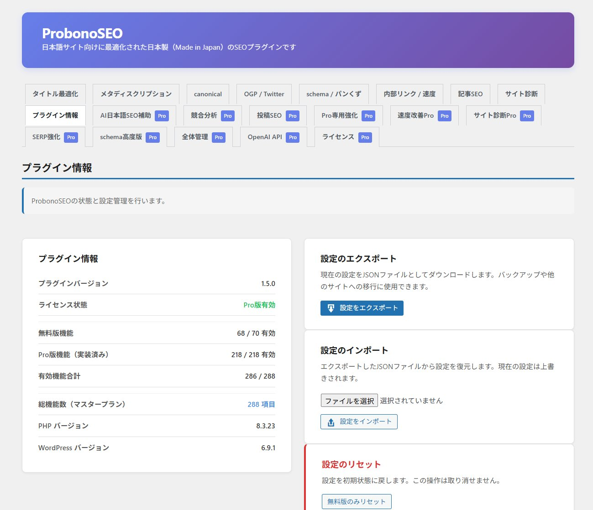
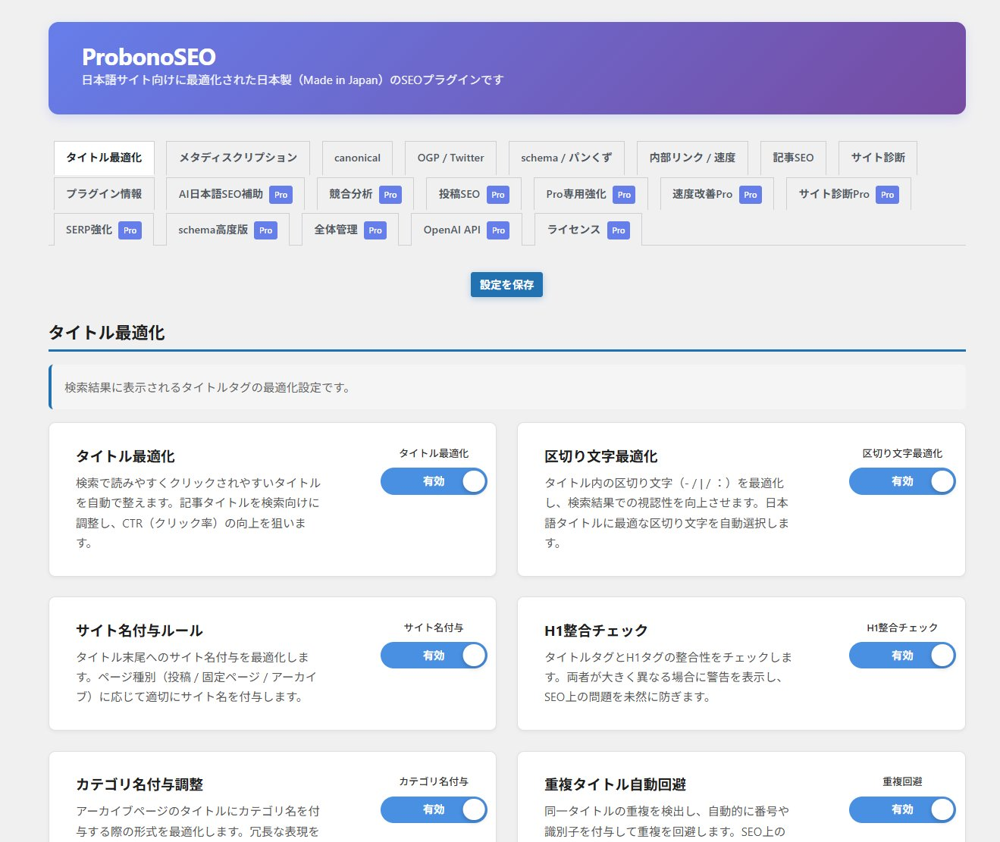
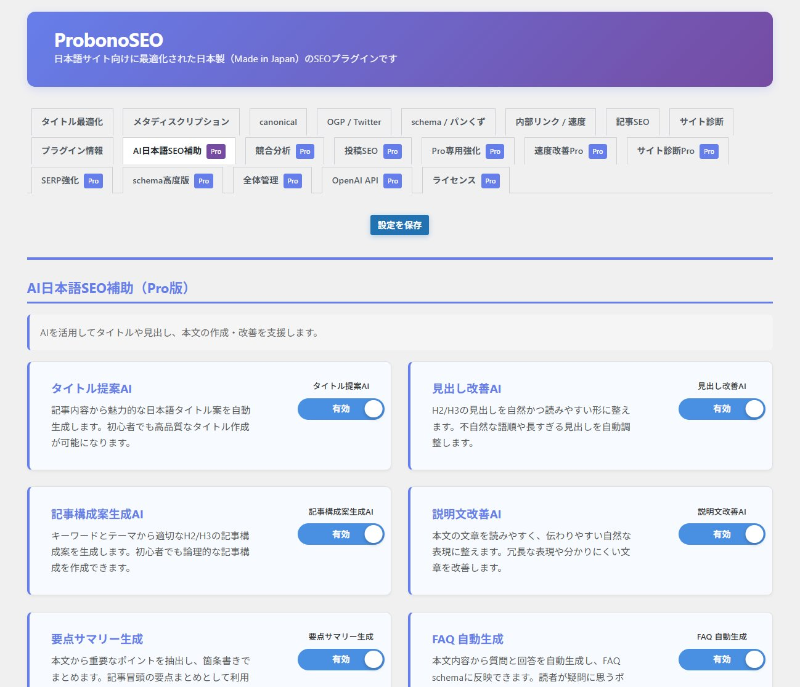
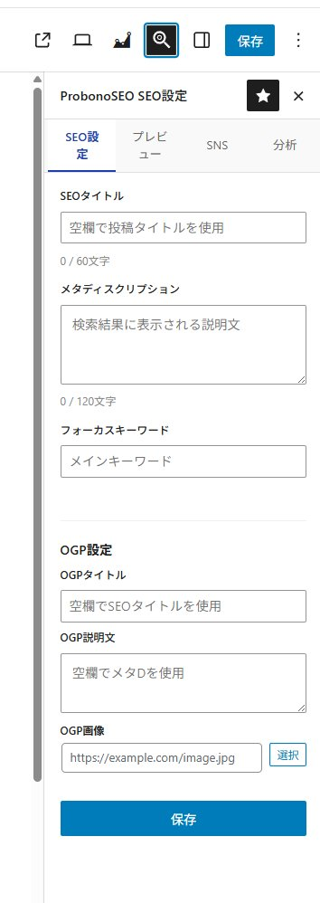
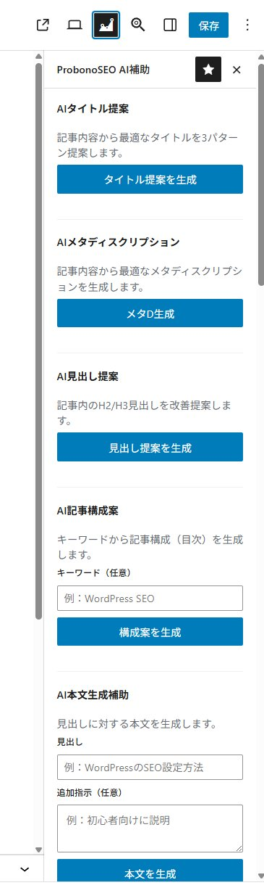

# ProbonoSEO

**日本語サイトに最適化された、Made in Japan の総合SEOプラグイン**

無料70機能 + Pro218機能 = 全288機能

- 日本語に最適化されたSEOエンジンをゼロから構築
- 無料70機能、広告なし、トラッキングなし
- Pro218機能は買い切りライセンス（サブスクなし）
- WordPress Plugin Check 完全準拠

## 概要

ProbonoSEO は、日本語サイトのために設計・開発された総合SEOプラグインです。日本語の文章構造やコンテンツパターンを前提に、ゼロから構築しました。

**ProbonoSEO を選ぶ理由**

- **Made in Japan** - 日本のSEOを理解した日本人開発者が開発
- **無料で70機能** - 他のSEOプラグインより多い無料機能
- **日本語最適化** - 日本語のタイトル、メタディスクリプションを適切に処理
- **買い切り型** - Pro版はサブスクではなく、一度の購入で永続利用

## 動作環境

| 項目 | バージョン |
|------|-----------|
| WordPress | 6.0 以上 |
| PHP | 7.4 以上 |
| 動作確認済み | WordPress 6.9 |

## インストール

### ProbonoSEO 公式サイトから（推奨）

1. [seo.prbn.org](https://seo.prbn.org) から最新版をダウンロード
2. WordPress管理画面 → プラグイン → 新規追加 → プラグインのアップロード
3. ZIPファイルをアップロードして「今すぐインストール」
4. プラグインを有効化
5. 管理画面メニュー「ProbonoSEO」を開く

### WordPress.org から（準備中）

WordPress.org 審査中です。承認後：

1. WordPress管理画面 → プラグイン → 新規追加
2. 「ProbonoSEO」で検索
3. 「今すぐインストール」→ 有効化

無料版の機能（70）– 常に利用可能

### タイトル最適化（7機能）
基本タイトルタグ最適化、区切り文字設定、サイト名付加設定、タイトルとH1の一致チェック、カテゴリ名付加設定、タイトル重複チェック、記号・絵文字使用警告

### メタディスクリプション（7機能）
基本メタディスクリプション最適化、本文自動抽出、キーワード自動抽出、要約自動生成、禁止語句チェック、文字数チェック、重複チェック

### canonical（5機能）
基本canonical設定、canonical自動生成、末尾スラッシュ統一、wwwあり/なし統一、パラメータ除去

### OGP / Twitterカード（12機能）
基本OGP出力、OGPタイトル/説明文設定、OGP画像自動取得、OGPデフォルト画像設定、Facebook App ID設定、LINE対応OGP、サムネイル自動生成、画像サイズ検出、画像alt属性チェック、日本語URL対応、Twitterカード出力

### schema / パンくず（16機能）
schema: Article、WebSite、WebPage、Organization、Person、BreadcrumbList、SearchAction、ImageObject

パンくず: トップ、カテゴリ、タグ、投稿、固定ページ、アーカイブ、検索結果、404

### 内部リンク / 速度（12機能）
前後記事リンク、同カテゴリ記事リンク、子ページリンク、関連記事リンク、タグ関連ロジック、外部リンクnofollow、画像/iframe遅延読み込み、CSS/JS圧縮、WordPress標準スクリプト最適化

### 記事SEO（6機能）
見出し構造チェック、画像alt属性チェック、画像数チェック、文字数チェック、カテゴリ適合チェック、タグ重複チェック

### サイト診断（3機能）
タイトル重複診断、メタディスクリプション重複診断、表示速度診断

### その他（2機能）
meta要素クリーンアップ、Google Search Console認証コード設定

Pro版の機能（218）– 買い切りライセンス

[seo.prbn.org](https://seo.prbn.org) でライセンス購入（買い切り）すると、すべてのPro機能が解放されます。

| カテゴリ | 機能数・内容 |
|----------|-------------|
| AI日本語SEO補助 | 21機能 - AIタイトル提案、見出し最適化、FAQ生成、コンテンツ分析（OpenAI APIキーが必要） |
| 競合分析 | 12機能 - タイトル・メタ・見出し・文字数・schema分析、PDFレポート |
| 投稿SEO | 21機能 - 投稿ごとのSEO設定、SERPプレビュー、SNSプレビュー、SEOスコア |
| Pro専用強化 | 39機能 - カスタム投稿タイプ、REST API、WP-CLI、Google Search Console連携 |
| リッチスニペット対応 | 42機能 - FAQ、HowTo、レビュー、レシピ、イベント、商品、動画、求人、ローカルビジネス schema |
| schema高度版 | 50機能 - Software、Course、Book、Movie、MusicAlbum、Podcast、他44種類 |
| 速度改善Pro | 18機能 - WebP/AVIF変換、クリティカルCSS、フォント最適化、ページキャッシュ |
| サイト診断Pro | 12機能 - インデックスステータス、Core Web Vitals、セキュリティ診断、PDFレポート |
| 全体管理 | 3機能 - メール/Slack通知、デバッグモード |

## スクリーンショット

*ダッシュボード - 全288機能の概要*

*タイトル最適化 - 無料版機能*

*AI日本語SEO補助 - Pro版機能*

*投稿編集画面 - SEO設定サイドバー*

*AIパネル - タイトル・メタ・見出し提案*

## セキュリティ

- 無料版は外部通信なし
- トラッキングなし
- プラグイン内に広告なし
- Pro版はライセンス認証時のみ公式サーバーと通信
- AI機能はサイト所有者自身のOpenAI APIキーを使用
- WordPress Plugin Check および WordPress コーディング規約に完全準拠

## 外部サービスへの接続

### ライセンス認証（Pro版のみ）
Proライセンス有効化時にライセンスサーバーへ接続します。
- サービスURL: https://seo.prbn.org/api/
- 送信データ: ライセンスキー、サイトURL
- [プライバシーポリシー](https://seo.prbn.org/privacy-policy/) | [利用規約](https://seo.prbn.org/terms/)

### OpenAI API（Pro版のみ、オプション）
AI搭載SEO機能はユーザー自身のOpenAI APIキーを使用します。
- [OpenAI プライバシーポリシー](https://openai.com/privacy/) | [利用規約](https://openai.com/terms/)

無料版は外部サービスに接続しません。

## サポート

- **公式サイト**: [seo.prbn.org](https://seo.prbn.org)
- **ブログ / 更新情報**: [note.com/probono_design](https://note.com/probono_design)

## ライセンス

GPL v2 or later - [https://www.gnu.org/licenses/gpl-2.0.html](https://www.gnu.org/licenses/gpl-2.0.html)

## 更新履歴

### 1.5.0
- WordPress.org Plugin Check 完全対応
- PHPCS コーディング規約準拠
- セキュリティ関連コードの改善

### 1.4.2
- WordPress 6.9 対応
- Plugin Check 対応

### 1.0.0
- 初回リリース（無料70機能 + Pro218機能）

---

**ProbonoSEO** - Made in Japan 🇯🇵
